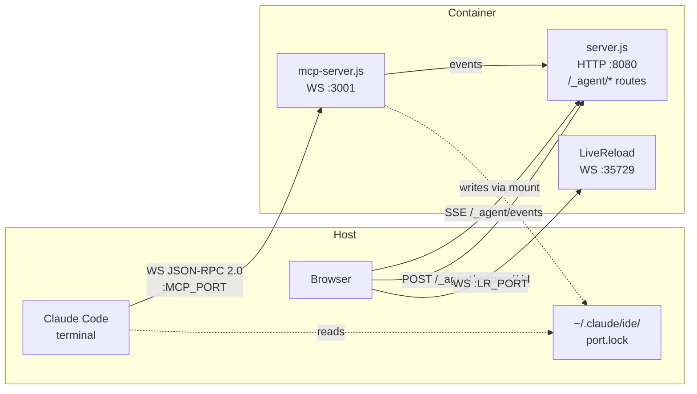
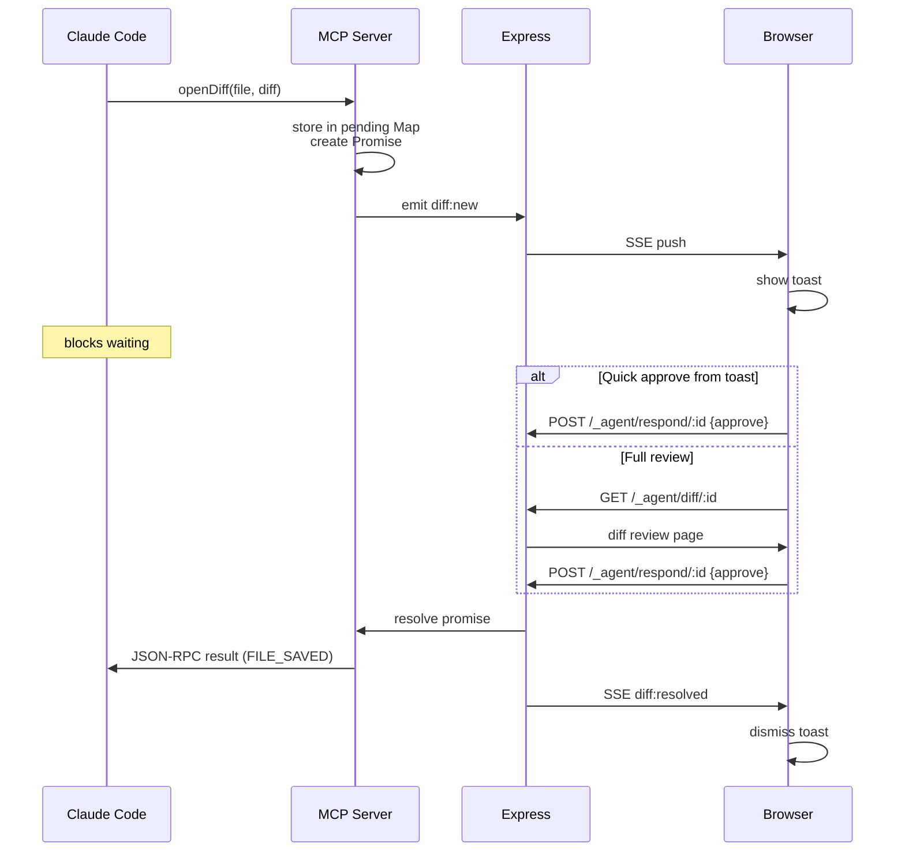

# Coding Agent Integration — Design Document

## Context

git-browse is a markdown/directory browser with git integration, typically run in Docker containers. Developers increasingly use coding agents (Claude Code, Gemini CLI) that make file changes requiring review. Currently, reviewing those changes means switching to an IDE or terminal. This design adds first-class agent integration so git-browse becomes a review companion — showing diffs, accepting approvals, and feeding decisions back to the agent in real time.

The initial implementation targets Claude Code using its [IDE integration protocol](https://github.com/coder/claudecode.nvim/blob/main/PROTOCOL.md). The architecture is designed to accommodate additional agents (Gemini CLI) later.

## Interaction model

git-browse acts as a **sidecar review companion**, not a full IDE. The user launches Claude Code separately (in a terminal). git-browse provides the review surface: it shows proposed diffs and lets the user approve or reject them.

**Connection flow:**
1. git-browse starts an MCP WebSocket server inside the container
2. Writes a lock file to `~/.claude/ide/<port>.lock` (via mounted volume) advertising its workspace
3. User launches `claude` from the repo directory
4. Claude Code discovers the lock file, matches by workspace folder, connects via WebSocket
5. `start.sh` prints connection info as fallback if auto-discovery fails

Multiple git-browse instances coexist safely — each advertises its own workspace folder in the lock file. Claude Code matches to the correct instance.

## Architecture

### Approach: Minimal Seam

Two new files, SSE for browser notifications, in-memory state. No changes to LiveReload or existing WebSocket patterns.



### Data flow: `openDiff`



## New files

### `src/mcp-server.js` (~200–250 lines)

MCP WebSocket server handling the Claude Code protocol.

**Responsibilities:**
- WebSocket server on fixed port 3001 (container-internal)
- Auth token generation and validation via `x-claude-code-ide-authorization` header
- Lock file lifecycle (write on start, clean up on exit) to mounted `~/.claude/ide/`
- JSON-RPC 2.0 message handling
- Pending diff store: `Map<id, { params, status, resolve, createdAt }>`
- Event emitter for Express routes to subscribe to (`diff:new`, `diff:resolved`, `agent:connected`, `agent:disconnected`)
- Host ↔ container path translation

**MCP tools (v1):**

| Tool | Behaviour |
|---|---|
| `openDiff` | **Blocking.** Stores diff in pending Map, emits event, returns Promise. Resolves with `FILE_SAVED` or `DIFF_REJECTED` when user responds. |
| `openFile` | Emits event with translated path. Browser navigates to the file. Returns immediately. |
| `getWorkspaceFolders` | Returns `[REPO_PATH]` (host path). |
| `closeAllDiffTabs` | Clears all pending diffs, emits event. Browser dismisses toasts. |

**Path translation:**
- `REPO_PATH` env var = host-side repo root (e.g. `/home/user/project`)
- Container serves `/var/www`
- Incoming host path: strip `REPO_PATH` prefix → prepend `/var/www`
- Path outside `REPO_PATH`: return MCP error with message `"File outside served repository. Expected paths under: <REPO_PATH>"`

**Lock file format:**
```json
{
  "pid": 1,
  "workspaceFolders": ["/home/user/project"],
  "ideName": "git-browse",
  "transport": "ws",
  "authToken": "550e8400-e29b-41d4-a716-446655440000"
}
```

The lock file name is `<port>.lock` where port is the **host-side** mapped port (not the container-internal 3001). The `MCP_PORT` env var carries this host-side port so the container can write the correct lock file name and Claude can connect.

### `src/agent-bridge.js` (~250–300 lines)

Client-side bridge between the browser and the agent integration routes.

**Responsibilities:**
- SSE connection to `/_agent/events`, with replay of pending diffs on reconnect
- Toast UI rendering (bottom-right, distinct from change-tracker toast)
- Quick approve/reject buttons on toast
- File name link in toast → navigates to `/_agent/diff/:id`
- Agent connection status indicator (toolbar badge)
- Exposes `window.__gitBrowseAgent = { pending, approve, reject }` for command palette integration

**Toast design:**
- Header: agent name badge + "diff review" label
- Body: file path (clickable link), +/- line counts
- Footer: Approve (green) and Reject (red) buttons
- Stacks vertically if multiple pending diffs
- Auto-dismisses with brief confirmation flash after action

## Modifications to existing files

### `src/server.js`

~50–60 lines added. No structural changes.

New route group `/_agent/*`:

| Route | Method | Purpose |
|---|---|---|
| `/_agent/events` | GET | SSE stream. Sends current pending diffs on connect, then streams events from MCP server's event emitter. |
| `/_agent/respond/:id` | POST | Receives `{ action: "approve" \| "reject" }`. Resolves the pending diff promise. Returns 200 on success, 404 if diff not found. |
| `/_agent/diff/:id` | GET | Serves a diff review page (Handlebars template). Shows unified diff with syntax highlighting, sticky approve/reject bar. |
| `/_agent/status` | GET | Returns `{ connected: bool, agentName: string \| null, pendingCount: number }`. |

MCP server started in the `if (require.main === module)` block, after Express starts.

### Templates

`src/templates/markdown.html` and `src/templates/directory.html`: add `<script>` tag for `agent-bridge.js`.

### `compose.yml`

```yaml
ports:
  - "${PORT:-8080}:8080"
  - "${LIVERELOAD_PORT:-35729}:${LIVERELOAD_PORT:-35729}"
  - "${MCP_PORT:-3001}:3001"                                    # new
volumes:
  - "${REPO_PATH:-.}:/var/www:ro"
  - "${CLAUDE_IDE_DIR:-${HOME}/.claude/ide}:/home/node/.claude/ide"  # new
environment:
  - GIT_BROWSE_REPO_ID
  - GIT_BROWSE_REPO_NAME
  - REPO_PATH=${REPO_PATH:-.}                                   # new
  - MCP_PORT=${MCP_PORT:-3001}                                   # new
```

### `Dockerfile`

Add `EXPOSE 3001`.

### `start.sh`

- Find free host port for MCP (same pattern as LiveReload port allocation)
- Export `MCP_PORT`, `REPO_PATH`, `CLAUDE_IDE_DIR`
- Print agent connection info after startup:
  ```
  Agent integration: ws://localhost:<MCP_PORT>
  Claude Code: launch 'claude' from the repo directory (auto-discovery via lock file)
  ```

## Diff review page

Route `/_agent/diff/:id` serves a full-page diff view rendered with the existing Handlebars template system.

**Content:**
- Sticky top bar: file path, agent name, Approve/Reject buttons
- Unified diff output with syntax highlighting (highlight.js)
- Line numbers, +/- indicators, hunk headers
- Standard breadcrumb navigation back to repo

**Diff source:** The `openDiff` tool call from Claude includes the file path. Since the repo is a live Docker bind mount, changes Claude makes on the host are immediately visible inside the container. The MCP server runs `git diff` on the translated container path to produce the diff. The diff output is stored in the pending diff Map for rendering.

## Multi-agent extensibility

The architecture separates protocol handling from the review UI:

| Layer | Agent-specific | Agent-neutral |
|---|---|---|
| Protocol | `src/mcp-server.js` (Claude Code MCP) | — |
| HTTP routes | — | `/_agent/*` in `server.js` |
| Browser | — | `src/agent-bridge.js` |
| State | — | Pending diff Map (shared abstraction) |

Adding Gemini CLI later means:
- New file `src/gemini-server.js` (or restructure as `src/agents/claude-code.js`, `src/agents/gemini-cli.js`)
- Same pending diff Map, same Express routes, same client bridge
- Each agent type has its own discovery/connection mechanism but feeds into the shared store

## Security

- MCP WebSocket binds to `0.0.0.0` inside the container (needed for port mapping), but the host-side mapped port is on `127.0.0.1` (Docker default)
- Auth token validated on every WebSocket connection via custom header
- Lock file contains auth token — only readable by the user who owns `~/.claude/ide/`
- No authentication on `/_agent/*` Express routes (same trust model as all other git-browse routes — single-user tool on localhost)

## Library recommendations

### Diff rendering: `diff2html` v3.4.56

Purpose-built for rendering `git diff` output as styled HTML. Supports both unified and side-by-side views with synchronised scrolling.

- **Use the `-ui-base` bundle** (88 KB min + 17 KB CSS) — it includes the `Diff2HtmlUI` class but excludes highlight.js, avoiding a duplicate since the project already loads it.
- Native `highlightCode()` method wires into the existing highlight.js instance for syntax highlighting within diff lines.
- CDN-hosted (jsDelivr), no build step — fits the project's vanilla JS pattern.
- No serious alternatives exist for browser-side unified diff rendering outside React/Vue-specific libraries.

```
https://cdn.jsdelivr.net/npm/diff2html@3.4.56/bundles/js/diff2html-ui-base.min.js
https://cdn.jsdelivr.net/npm/diff2html@3.4.56/bundles/css/diff2html.min.css
```

### JSON-RPC 2.0: `json-rpc-2.0` v1.7.1

Transport-agnostic JSON-RPC 2.0 implementation. Zero dependencies.

- Handles method dispatch, error formatting, and notification detection (messages without `id` get no response — required by the MCP protocol).
- Transport-agnostic design means we wire it to `ws` ourselves, retaining full control over connection lifecycle, auth validation, and per-connection state.
- **Not using the official MCP SDK** (`@modelcontextprotocol/sdk` v1.28.0) — it has no server-side WebSocket transport (only stdio/SSE/HTTP), pulls 17 dependencies including Express 5 (conflicts with our Express 4), and is designed for building MCP tool servers, not IDE integrations.

### WebSocket: `ws` (promote to direct dependency)

Already installed as a transitive dependency via `livereload` (`ws@7.5.10`, hoisted to top-level `node_modules/`).

- Add `"ws": "^7.5.10"` to `package.json` `dependencies` — makes the dependency explicit and survives `npm prune` or changes in `livereload`.
- No new download; npm notes the additional constraint on the already-installed version.

### Auth tokens: `crypto.randomUUID()` (built-in)

Node.js built-in, available in all current LTS versions. Generates RFC 4122 v4 UUIDs. No external package needed.

### Server-side diff computing: `diff` (jsdiff) v8.0.4 (optional)

If `git diff` output proves insufficient (e.g. for files not yet tracked by git), `diff` can generate unified diff strings from two arbitrary strings via `Diff.createTwoFilesPatch()`. Zero-config, 30 KB browser bundle also available via CDN. Defer adding this until a concrete need arises.

### Dependency impact

| Action | Package | Transitive deps |
|---|---|---|
| Add | `json-rpc-2.0@^1.7.1` | 0 |
| Promote | `ws@^7.5.10` | 0 (already installed) |
| CDN only | `diff2html@3.4.56` | n/a (browser script) |
| **Total new deps** | **1** | **0** |

## Verification plan

1. **Unit tests** for `mcp-server.js`: JSON-RPC message handling, path translation, auth validation, lock file write/cleanup
2. **Integration test**: mock WebSocket client sends `openDiff` → verify SSE event emitted → POST approve → verify WS response
3. **Manual end-to-end**:
   - Start git-browse with `start.sh` in a repo
   - Verify lock file appears in `~/.claude/ide/`
   - Launch `claude` from the same repo directory
   - Have Claude make a file change → verify toast appears in browser
   - Click "View" → verify diff page renders correctly
   - Click "Approve" → verify Claude receives FILE_SAVED and continues
   - Test "Reject" flow similarly
   - Test path outside repo → verify MCP error
4. **Multi-instance**: run two git-browse instances for different repos, verify Claude connects to the correct one
